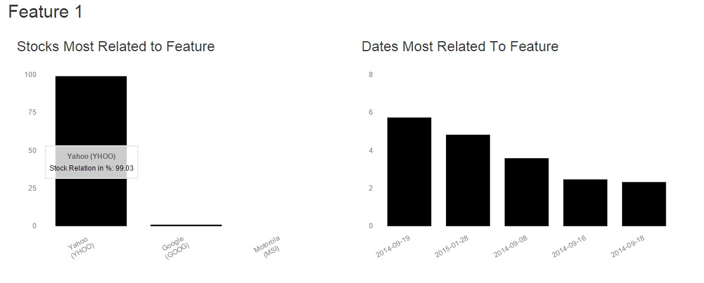

# 1. About the Project
The main idea of this project is to extract the important features of stock trading volume data pulled from Yahoo! Finance API. Extracted features could indicate patterns of important trading days or the ways that underlying factors can drive the volume of multiple stocks.  
The project uses Non-Negative Matrix Factorization (NMF). Using NMF, the original data matrix (D) containing data about stocks and their daily trading volumes is factorized into two resulting matrices W (weight matrix) and H (features matrix), such that <b>W * H ≈ D</b>.  
By analysing H and W matrices certain features can be identified and stocks and dates most related to these features are extracted and visualized.  

# 2. Non-Negative Matrix Factorization
Non-Negative Matrix Factorization (NMF) is a recent technique for dimensionality
reduction and data analysis that yields a parts based, sparse
nonnegative representation for nonnegative input data. NMF has found
a wide variety of applications, including text analysis, document clustering,
face/image recognition, language modeling, speech processing and
many others. Despite these numerous applications, the algorithmic development
for computing the NMF factors has been relatively deficient.[1]

NMF can be applied to the statistical analysis of multivariate data in the following manner.
Given a set of of multivariate n-dimensional data vectors, the vectors are placed in the
columns of an n x m matrix V where m is the number of examples in the data set. This
matrix is then approximately factorized into an n x r matrix W (weights matrix) and an r x m matrix H (features matrix), where r is the number of features defined by the user.
Usually r is chosen to be smaller than n or m, so that W and H are smaller than the original
matrix V. This results in a compressed version of the original data matrix.[2]  

Illustration below shows how the V matrix is reconstructed by multiplying the
weights matrix by the features matrix.

  

<i>Multiplying the weights matrix by the features matrix</i>[3]

In this project NMF technique is used to extract the important features of data about stock trading volume and to identify relevance of each stock and date to extracted features so underlying patterns of important trading days or the ways that underlying factors can drive the volume of multiple stocks.  

# 3. Dataset
Dataset used in this project is obtained from [Yahoo! Finance API](http://finance.yahoo.com/).  
This API returns CSV file with information about certain stocks, containing their opening price, highest price, lowest price, closing price, adjusted closing price and their volume per date.  
Volume is
used instead of closing price because NMF tries to find positive features that can be
added together; prices often move down in response to events, and NMF will not find
negative features. Volume, however, is more easily modeled as having a basal level in the absence of external events
that can increase in response to outside influence, making it suitable for positive
matrices.[4]  

# 4. Technical Implementation
The application is written in Java and Javascript. All core operations are implemented in Java and Javascript is used for data visualization.  
 
Libraries used in project are:  

[JAMA](http://math.nist.gov/javanumerics/jama/) for matrix operations  
[Opencsv](http://opencsv.sourceforge.net/) for reading CSV data retrieved through API calls   [GSON](https://github.com/google/gson) to format the resulting features for visualization  
[Morris.js](http://morrisjs.github.io/morris.js/) for data visualization  
 
Core package contains classes in charge for data collection, NMF algorithm and JSON generation.  
Faktorizuj class in sysop package executes the whole operation by invoking methods of classes from core package.  
Kontroler class in logic package invokes the static method of Faktorizuj class to execute the operation.   
System can be invoked using RESTful web service by forwarding parameters such as number of features and company names via HTTP GET request.  
User interface is web based and it is used for selecting stocks, number of features and visualization of results. 
After the end of operation execution generated JSON with features data will be sent to client for visualization. 

# 5. Results Example
As input, three stocks were selected: Google (GOOG), Yahoo! (YHOO) and Motorola (MSI). 10 features were requested to be extracted for trading volume of these three stocks.  
After processing, the result page contains 2 charts per each feature: one for stock to feature expression and the other one for date to feature expression.  

Let's take a look at an example:   
  
 

We can determine that YHOO stock is extremely expressed in this feature, and that the top two dates mostly related to this feature are September 19th 2014 and January 28th 2015. Searching for news article about Yahoo! published on these dates gives us context:
 On September 19th 2014 Yahoo!'s stocks went down 2.7 percent after Alibaba Group Holding, which Yahoo owns a stake in, made its stock market debut.Yahoo, which sold more than 120 million of its 524 million Alibaba shares in the initial public offering, declined to $40.93 at the close in New York.
 On January 28th 2015 Yahoo Chief Executive Marissa Mayer unveiled a plan to split off the company's 40-percent stake in Alibaba into a new company called SpinCo, so the company could avoid a potential tax bill of up to $16 billion under a traditional sale of the stake. Shares in Yahoo jumped almost 7 percent to $51.2 in after-hours trading on Tuesday as investors cheered the plan.  
This feature is a good example why using trading volume instead of closing price is better for identifying interesting features in stock trading data.

# 6. Acknowledgements
This project has been developed as a project assignment for the [Intelligent Systems](http://is.fon.rs/) course at the [Faculty of Organizational Sciences](http://www.fon.bg.ac.rs/eng/), University of Belgrade.

# 7. References
[1] Inderjit S. Dhillon, Suvrit Sra, "Generalized Nonnegative Matrix Approximations with Bregman Divergences", link: http://papers.nips.cc/paper/2757-generalized-nonnegative-matrix-approximations-with-bregman-divergences.pdf, last access: 05.08.2015.  
[2] Daniel D. Lee, H. Sebastian Seung, "Algorithms for Non-negative Matrix Factorization", link: http://papers.nips.cc/paper/1861-algorithms-for-non-negative-matrix-factorization.pdf, last access: 05.08.2015.  
[3] Wikipedia, "Non-negative matrix factorization" link: https://en.wikipedia.org/wiki/Non-negative_matrix_factorization, last access: 05.08.2015.   
[4]Segaran, Toby. 2007. <i>Programming Collective Intelligence</i>. Sebastopol, California: O'Reilly Media.
